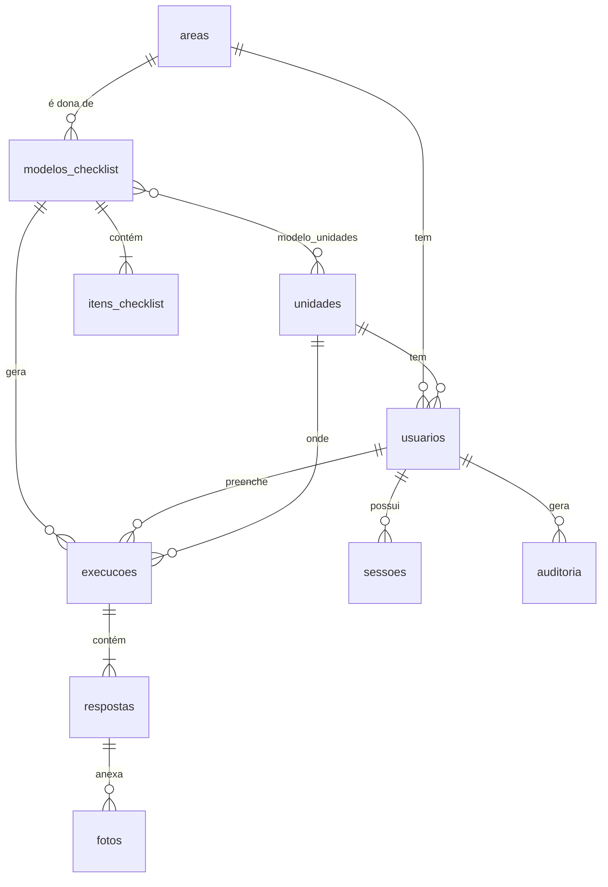

# Checklists de Manutenção

Aplicativo web responsivo (PWA) para controle de manutenções por meio de checklists. Funciona no celular e no computador com os mesmos dados, que ficam em um único banco no servidor.

- **Backend:** Python 3.11+ · Flask · SQLAlchemy · SQLite
- **Frontend:** HTML/CSS/JS sem frameworks, mobile-first, instalável (PWA)
- **Perfis:** Admin+ (tudo), Admin (própria área), Analista de filial (só preenche)

---

## 1. Estrutura de pastas

```
.
├── app/
│   ├── __init__.py        # create_app(): extensões, cabeçalhos de segurança, erros
│   ├── config.py          # configuração lida do .env
│   ├── extensions.py      # db, login, CSRF, rate limit
│   ├── models.py          # tabelas (SQLAlchemy ORM)
│   ├── security.py        # Argon2id, política de senha, @roles_required
│   ├── permissions.py     # regras de perfil/área/unidade (anti-IDOR)
│   ├── auth.py            # login, logout, sessões no servidor, bloqueio
│   ├── main.py            # Home, preenchimento, histórico, fotos, PWA
│   ├── admin.py           # Configuração: usuários, áreas, unidades, checklists, auditoria
│   ├── uploads.py         # validação e reprocessamento das fotos
│   ├── audit.py           # log de auditoria
│   ├── utils.py           # datas/fuso, leitura de formulário
│   └── cli.py             # comandos flask: seed, init-db, create-admin
├── templates/             # páginas Jinja2 (escape automático)
├── static/                # css, js, ícones, manifest e service worker
├── tests/                 # testes automatizados (pytest)
├── uploads/.gitkeep       # fotos (conteúdo não versionado)
├── scripts/gerar_icones.py
├── seed.py                # cria banco, áreas/unidades e o primeiro Admin+
├── wsgi.py                # ponto de entrada
├── requirements.txt       # dependências fixadas
├── requirements-dev.txt   # + pytest
├── .env.example
├── Dockerfile
└── docker-compose.yml     # app + Caddy (HTTPS automático)
```

## 2. Modelo de dados



| Tabela | Principais campos | Observações |
|---|---|---|
| `areas` | nome (único), ativo | Engenharia, T.I., Jurídico… cadastráveis |
| `unidades` | nome (único), ativo | Belém, Vitória, Juiz de Fora… cadastráveis |
| `usuarios` | nome, email (único), senha_hash, perfil, area_id, unidade_id, ativo, tentativas_falhas, bloqueado_ate | perfil ∈ `admin_plus`, `admin`, `analista` |
| `sessoes` | id (SHA-256 do token), usuario_id, expira_em, ultimo_uso, ip | permite logout real e revogação |
| `modelos_checklist` | titulo, descricao, area_id, periodicidade, ativo | periodicidade: sob demanda, diário, semanal, mensal |
| `modelo_unidades` | modelo_id, unidade_id | vazio = vale para todas as unidades |
| `itens_checklist` | modelo_id, ordem, texto | |
| `execucoes` | modelo_id, usuario_id, unidade_id, area_id, titulo, status, iniciado_em, concluido_em | quem, quando e onde |
| `respostas` | execucao_id, item_id, ordem, item_texto, status (C/NC/NA), observacao | guarda cópia do texto do item |
| `fotos` | resposta_id, arquivo (UUID), tamanho | arquivo fica em `uploads/` |
| `auditoria` | usuario_id, email, acao, alvo, detalhe, ip, criado_em | |

Execuções guardam uma cópia do título e dos itens. Editar um checklist depois não altera o que já foi preenchido. Registros com histórico são **desativados** em vez de apagados.

## 3. Regras de acesso

| | Admin+ | Admin | Analista |
|---|---|---|---|
| Usuários | todos | analistas da própria área | — |
| Áreas e unidades | cadastra/edita/remove | — | — |
| Modelos de checklist | todos | da própria área | — |
| Preencher checklist | qualquer modelo/unidade | modelos da área, escolhendo a unidade | só a própria unidade/área |
| Ver realizados | todos | da própria área | da própria unidade/área |
| Reabrir checklist concluído | sim | da própria área | não |
| Auditoria | sim | — | — |
| Meus dados / trocar senha | sim | sim | sim |

Um Admin cadastra apenas **analistas** da própria área. Assim, um Admin não consegue criar outro Admin nem tirar o acesso de um colega. Para mudar essa regra, edite `perfis_atribuiveis` e `pode_gerenciar_usuario` em `app/permissions.py`.

## 4. Rodar localmente

### Windows (PowerShell)

```powershell
py -m venv venv
.\venv\Scripts\Activate.ps1
pip install -r requirements-dev.txt
copy .env.example .env
python -c "import secrets; print(secrets.token_hex(32))"   # cole o valor em SECRET_KEY no .env
python seed.py --exemplo                                  # pede e-mail e senha do primeiro Admin+
flask --app wsgi run
```

### Linux / macOS

```bash
python3 -m venv venv
source venv/bin/activate
pip install -r requirements-dev.txt
cp .env.example .env
python -c "import secrets; print(secrets.token_hex(32))"   # cole em SECRET_KEY
python seed.py --exemplo
flask --app wsgi run
```

Acesse **http://localhost:5000**. Os navegadores aceitam cookies `Secure` em `localhost`, então o `.env` padrão já funciona.

> **Testar pelo celular na rede local (HTTP):** defina `SESSION_COOKIE_SECURE=false` no `.env` e rode `flask --app wsgi run --host 0.0.0.0`. Use isso **só para teste**. Para instalar como app (PWA) no celular é preciso HTTPS (veja o Deploy).

### Criar o primeiro Admin+

`python seed.py` cria as tabelas, as áreas e unidades iniciais e o primeiro Admin+. Ele lê `ADMIN_EMAIL`, `ADMIN_NAME` e `ADMIN_PASSWORD` do `.env` e pergunta no terminal o que estiver faltando. A senha precisa seguir a política: 10+ caracteres, com maiúscula, minúscula, número e símbolo. **Se colocar a senha no `.env`, apague-a depois.**

Outros comandos:

```bash
flask --app wsgi create-admin      # cria outro Admin+ interativamente
flask --app wsgi seed --sem-interacao --exemplo   # usa só variáveis de ambiente (CI/Docker)
flask --app wsgi limpar-sessoes    # remove sessões expiradas
```

### Testes

```bash
pytest
```

Os testes cobrem login, bloqueio por tentativas, sessão/logout, CSRF, cabeçalhos, XSS, IDOR entre unidades e áreas, permissões por perfil, upload malicioso e o fluxo completo do checklist.

## 5. Subir no GitHub

```bash
git init
git add .
git status            # confira: NÃO podem aparecer .env, *.db, instance/ nem fotos em uploads/
git commit -m "Primeira versão do app de checklists"
git branch -M main
git remote add origin https://github.com/SEU-USUARIO/checklists-manutencao.git
git push -u origin main
```

Crie o repositório como **privado** no GitHub antes do `push`. Se um segredo for commitado por engano, troque o valor (gere outra `SECRET_KEY`) em vez de só apagar o arquivo, porque ele continua no histórico.

## 6. Deploy

### Opção A: Docker + Caddy (HTTPS automático)

1. Um servidor Linux com Docker e um domínio apontando para ele (ex.: `checklist.suaempresa.com.br`).
2. No servidor:
   ```bash
   git clone https://github.com/SEU-USUARIO/checklists-manutencao.git && cd checklists-manutencao
   cp .env.example .env    # preencha SECRET_KEY, SESSION_COOKIE_SECURE=true e adicione DOMINIO=checklist.suaempresa.com.br
   docker compose up -d --build
   docker compose exec app python seed.py      # cria o primeiro Admin+
   ```
3. O Caddy emite o certificado HTTPS sozinho. Banco e fotos ficam nos volumes `dados` e `fotos`.

### Opção B: servidor sem Docker

```bash
pip install -r requirements.txt
waitress-serve --listen=127.0.0.1:8000 --threads=8 wsgi:app
```

Coloque um proxy reverso com HTTPS na frente (Caddy, Nginx ou IIS) e defina `TRUST_PROXY=1` no `.env`. Exemplo de `Caddyfile`:

```
checklist.suaempresa.com.br {
    reverse_proxy 127.0.0.1:8000
    request_body {
        max_size 50MB
    }
}
```

### Backup

Faça cópia diária do banco (`instance/checklist.db` ou o volume `dados`) e da pasta `uploads/` (volume `fotos`). Com o app rodando, use `sqlite3 checklist.db ".backup backup.db"` para uma cópia consistente.

### Escala

O SQLite atende bem dezenas de usuários simultâneos com um único servidor. O limite de tentativas por IP fica em memória (`RATELIMIT_STORAGE_URI=memory://`). Com vários processos ou servidores, use Redis (`redis://...`). O bloqueio de conta por tentativas fica no banco e já vale para todos os processos.

## 7. O que foi feito em cada item de segurança

| Requisito | Implementação |
|---|---|
| **Hash de senha** | Argon2id (`argon2-cffi`), com rehash automático se os parâmetros mudarem. Nenhuma senha é gravada ou registrada em log. |
| **Política de senha** | Mínimo de 10 caracteres, com maiúscula, minúscula, número e símbolo. Recusa senhas comuns e senhas que contêm o e-mail. Vale no cadastro, na redefinição, na troca e no seed. |
| **Sessão / cookie** | O cookie é assinado e tem `HttpOnly`, `Secure`, `SameSite=Lax` e prefixo `__Host-`. Ele guarda só um token aleatório; o hash do token fica na tabela `sessoes`. A sessão expira após 60 min sem uso e, no máximo, 12 h depois do login. |
| **Logout** | Só por `POST` com CSRF. Apaga a sessão no servidor, então um cookie copiado deixa de valer (há teste para isso). |
| **Revogação** | Trocar a senha encerra as sessões nos outros dispositivos. Desativar um usuário ou mudar perfil, área ou senha dele encerra todas as sessões desse usuário. |
| **Força bruta** | Após 5 erros a conta fica bloqueada por 15 min (`LOGIN_MAX_ATTEMPTS`, `LOGIN_LOCK_MINUTES`). Há também limite por IP: 10/min e 60/h no login, 10/min na troca de senha. O hash é verificado mesmo quando o e-mail não existe, para o tempo de resposta não revelar quais e-mails estão cadastrados. A mensagem de erro é a mesma em todos os casos. |
| **CSRF** | `Flask-WTF CSRFProtect` em todos os `POST`. Toda alteração de dados exige `POST`; nenhuma ação muda dados via `GET`. |
| **SQL Injection** | Só ORM do SQLAlchemy, com parâmetros vinculados, sem SQL montado com texto. Nas buscas `LIKE`, os caracteres `%` e `_` são escapados. |
| **XSS** | Escape automático do Jinja2, sem uso de `|safe`. A CSP é rígida (`script-src 'self'`, sem `unsafe-inline`), sem scripts ou estilos inline. |
| **Autorização / IDOR** | `@roles_required` em todas as rotas administrativas. As funções de `permissions.py` checam perfil, área e unidade em cada registro acessado (execução, foto, usuário, modelo). Sem permissão a rota responde **404**, para não revelar que o registro existe. As consultas de listagem já são filtradas no SQL. O servidor ignora a unidade enviada pelo analista e usa a do cadastro. |
| **Upload de fotos** | Verifica a extensão e o MIME declarado (lista permitida: JPG, PNG, WEBP). O tipo real é detectado pelo conteúdo (Pillow) e precisa bater com a extensão. Limites: 8 MB por foto, 3 fotos por item, 50 MB por requisição e 40 MP de resolução (contra *decompression bomb*). A imagem é **decodificada e regravada** como JPEG de no máximo 1600 px, o que descarta EXIF/GPS e qualquer conteúdo embutido. O nome é um **UUID** gerado pelo servidor, e o caminho final é conferido contra a pasta (contra *path traversal*). O app também reduz a foto no celular antes de enviar, para economizar dados. |
| **Fotos privadas** | Ficam em `uploads/`, fora de `static/`. São servidas só pela rota `/fotos/<id>`, que exige login e checa o acesso à execução, com `Content-Type: image/jpeg`, `nosniff` e `Cache-Control: private`. O service worker nunca guarda fotos nem páginas autenticadas em cache. |
| **Cabeçalhos** | `Strict-Transport-Security`, `Content-Security-Policy`, `X-Content-Type-Options: nosniff`, `X-Frame-Options: DENY`, `frame-ancestors 'none'`, `Referrer-Policy`, `Permissions-Policy`, `Cross-Origin-Opener-Policy`, `Cross-Origin-Resource-Policy`, além de `Cache-Control: no-store` nas páginas. |
| **Segredos** | Ficam só no `.env`, que o `.gitignore` exclui. O app **não inicia** se a `SECRET_KEY` estiver ausente, curta ou for um valor de exemplo. |
| **Auditoria** | A tabela `auditoria` (visível ao Admin+) registra login com sucesso e com falha, bloqueio de conta, logout, troca de senha, criação/alteração/remoção de usuários, áreas, unidades e checklists, e início/conclusão/reabertura/descarte de execuções. Inclui usuário, IP e data. Senhas nunca são registradas. Quebras de linha são removidas para evitar falsificação de log. |
| **Erros genéricos** | Os erros têm páginas próprias (400/403/404/405/413/429/500) com mensagem simples. A exceção completa só vai para o log do servidor. O modo debug fica desligado por padrão. |
| **Dependências fixadas** | `requirements.txt` fixa as versões diretas e transitivas. Rode `pip-audit` periodicamente para checar vulnerabilidades conhecidas. |
| **Container** | Roda com usuário sem privilégios, sistema de arquivos somente leitura (exceto os volumes de dados) e `no-new-privileges`. |

### Recomendações operacionais

- Use sempre HTTPS em produção (`SESSION_COOKIE_SECURE=true`).
- Faça backup diário do banco e de `uploads/`.
- Revise a auditoria periodicamente e desative usuários que saíram da empresa.
- Atualize as dependências com `pip list --outdated`, rode os testes e só então publique.
